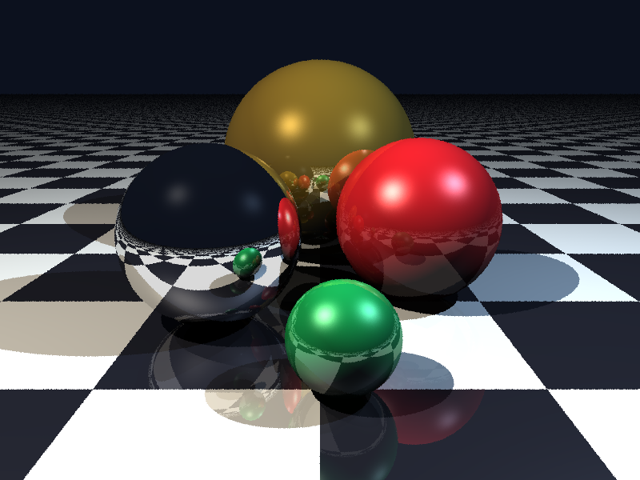

# Python OpenGL Ray Tracer

A modular, high-performance ray tracing engine built in Python and displayed interactively via PyOpenGL and GLFW. Designed specifically for Computer Graphics coursework and projects.



---

## 🌟 Key Features

- **Geometric Primitives**:
  - **Spheres**: Analytical ray-sphere quadratic intersection.
  - **Planes**: Infinite planar surfaces with procedural checkerboard texturing.
- **Blinn-Phong Illumination Model**:
  - **Ambient**: Base ambient illumination for shadowed areas.
  - **Diffuse (Lambertian)**: Cosine-weighted surface scattering ($N \cdot L$).
  - **Specular (Blinn-Phong)**: Realistic glossy highlights using the halfway vector ($N \cdot H$).
- **Realistic Light & Shadows**:
  - Point and directional lights.
  - Hard shadow casting with shadow acne bias offsets.
  - Colored multi-light shadow overlaps and penumbra-like intersections.
- **Recursive Specular Reflections**:
  - Multi-bounce mirror reflections ($R = D - 2(D \cdot N)N$).
  - Configurable bounce depth (1–6 bounces).
- **Interactive OpenGL Viewport**:
  - Live GLFW window with fullscreen textured quad.
  - Spherical mouse orbit, pan, and scroll-wheel zoom controls.
  - Dynamic resolution preview (smooth FPS while orbiting, instant sharp render when still).
- **Stochastic Super-Sampling Anti-Aliasing (MSAA)**:
  - Sub-pixel jittered ray sampling for clean, edge-smoothed final exports.
- **High-Resolution PNG Export**:
  - Save rendered frames to disk at any time via hotkey (`S`) or CLI flags.

---

## 📐 Mathematical Foundations

### 1. Parametric Ray
A 3D ray is defined parametrically as:
$$\mathbf{P}(t) = \mathbf{O} + t \mathbf{D}, \quad t \ge 0$$
where $\mathbf{O}$ is the ray origin and $\mathbf{D}$ is the normalized ray direction.

### 2. Ray-Sphere Intersection
A sphere with center $\mathbf{C}$ and radius $r$ satisfies:
$$\|\mathbf{P} - \mathbf{C}\|^2 = r^2$$

Substituting the ray equation $\mathbf{P}(t) = \mathbf{O} + t\mathbf{D}$ and setting $\mathbf{V} = \mathbf{O} - \mathbf{C}$:
$$t^2 (\mathbf{D} \cdot \mathbf{D}) + 2t (\mathbf{D} \cdot \mathbf{V}) + (\mathbf{V} \cdot \mathbf{V} - r^2) = 0$$

Since $\mathbf{D}$ is a unit vector, $\|\mathbf{D}\|^2 = 1$. The quadratic equation simplifies to:
$$t^2 + 2b't + c = 0$$
where $b' = \mathbf{D} \cdot \mathbf{V}$ and $c = \|\mathbf{V}\|^2 - r^2$.

The discriminant $\Delta = {b'}^2 - c$:
- If $\Delta < 0$: No intersection (ray misses the sphere).
- If $\Delta \ge 0$: The nearest valid positive root is $t = -b' - \sqrt{\Delta}$.

Surface unit normal at hit point $\mathbf{P}$:
$$\mathbf{N} = \frac{\mathbf{P} - \mathbf{C}}{r}$$

### 3. Ray-Plane Intersection
A plane with reference point $\mathbf{P}_0$ and normal $\mathbf{N}$ satisfies:
$$(\mathbf{P} - \mathbf{P}_0) \cdot \mathbf{N} = 0$$

Substituting the ray equation:
$$t = \frac{(\mathbf{P}_0 - \mathbf{O}) \cdot \mathbf{N}}{\mathbf{D} \cdot \mathbf{N}}$$
If $|\mathbf{D} \cdot \mathbf{N}| < 10^{-6}$, the ray is parallel to the plane.

### 4. Blinn-Phong Illumination Model
The total surface radiance $\mathbf{I}$ at hit point $\mathbf{P}$ is the sum of ambient, diffuse, and specular terms across all lights:

$$\mathbf{I} = k_a \mathbf{I}_a + \sum_{i} S_i \cdot \left[ k_d \mathbf{I}_{i} \max(\mathbf{N} \cdot \mathbf{L}_i, 0) + k_s \mathbf{I}_{i} (\max(\mathbf{N} \cdot \mathbf{H}_i, 0))^{\alpha} \right]$$

- $\mathbf{L}_i$: Unit vector from surface towards light source $i$.
- $\mathbf{V}$: Unit vector from surface towards camera (view direction).
- $\mathbf{H}_i = \frac{\mathbf{L}_i + \mathbf{V}}{\|\mathbf{L}_i + \mathbf{V}\|}$: The Blinn-Phong halfway vector.
- $\alpha$: Surface shininess exponent.
- $S_i \in \{0, 1\}$: Shadow factor determined by casting a shadow ray from $\mathbf{P} + \epsilon \mathbf{N}$ towards $\mathbf{L}_i$.

### 5. Specular Reflection
For reflective materials, secondary reflected rays are spawned along direction $\mathbf{R}$:
$$\mathbf{R} = \mathbf{D} - 2(\mathbf{D} \cdot \mathbf{N})\mathbf{N}$$
The final color blends local Phong shading with recursively traced reflection:
$$\mathbf{C}_{\text{final}} = (1 - k_r) \mathbf{C}_{\text{local}} + k_r \mathbf{C}_{\text{reflected}}$$

---

## 🗂️ Project Architecture

```
simple-ray-tracer/
├── main.py                     # Entry point (GUI viewer or CLI batch render)
├── requirements.txt            # Python package dependencies
├── README.md                   # Project documentation and theory
├── showcase_demo.png           # Sample rendered output (Showcase Studio)
├── three_spheres.png           # Sample rendered output (Three Spheres Lab)
│
├── raytracer/                  # Core ray tracing mathematical library
│   ├── __init__.py             # Package exports
│   ├── vector.py / math_utils.py # Vector operations (dot, norm, reflect)
│   ├── ray.py                  # Parametric Ray class
│   ├── material.py             # Optical material properties & procedural checker
│   ├── primitives.py           # Sphere & Plane analytical intersection solvers
│   ├── light.py                # Point, Directional, and Ambient light sources
│   ├── camera.py               # Pinhole Camera with spherical orbit & ray generation
│   ├── scene.py                # Scene container & 3 benchmark scene presets
│   ├── engine.py               # Blinn-Phong shading, shadow rays, recursive reflection
│   └── renderer.py             # Multi-sample anti-aliasing & disk export
│
└── viewer/                     # OpenGL hardware display
    ├── __init__.py
    └── gl_display.py           # GLFW window, OpenGL textured quad, live HUD, inputs
```

---

## 🚀 Getting Started

### 1. Requirements
- Python 3.9+ (Tested on Python 3.13)
- Graphics driver with OpenGL 3.3+ support

### 2. Installation
Install dependencies via pip:
```bash
pip install -r requirements.txt
```

---

## 🎮 How to Run

### Interactive OpenGL Mode
To launch the real-time interactive viewer:
```bash
python main.py
```

#### Keyboard & Mouse Controls

| Input | Action |
|---|---|
| **Left Click + Drag** | Orbit camera around center (Yaw / Pitch) |
| **Right Click + Drag** | Pan camera position |
| **Scroll Wheel** | Zoom In / Out |
| **W / S** | Move Camera Forward / Backward |
| **A / D** | Orbit Camera Left / Right |
| **1** | Switch to **Scene 1: Showcase Studio** (Chrome, Ruby, Gold, Emerald) |
| **2** | Switch to **Scene 2: Three Spheres Lab** (Red Diffuse, Green Reflective, Blue Specular) |
| **3** | Switch to **Scene 3: Recursive Reflections** (Mirrored Ground & Opposing Spheres) |
| **S** | **Save / Export HD PNG** render (`render_TIMESTAMP.png`) |
| **P** | Toggle **Shadows ON / OFF** |
| **R** | Toggle **Reflections ON / OFF** |
| **+ / -** | Increase / Decrease Max Reflection Bounces (0 to 6) |
| **Spacebar** | Force High-Quality Anti-Aliased Render (2x MSAA) |
| **ESC** | Exit Viewer |

---

### Command-Line (Headless) Render Mode
To generate offline high-resolution renders directly to image files without opening a window:

```bash
# Render Scene 1 (Showcase Studio) in Full HD with 2x Anti-Aliasing
python main.py --render --scene 1 --output showcase.png --width 1280 --height 720 --samples 2

# Render Scene 2 (Three Spheres) with custom reflection bounces
python main.py --render --scene 2 --output three_spheres.png --width 800 --height 600 --bounces 4

# Render without shadows to compare shading models
python main.py --render --scene 1 --output no_shadows.png --no-shadows
```

CLI options:
- `--scene {1, 2, 3}`: Choose preset scene.
- `--width`, `-W`: Image width (default: 800).
- `--height`, `-H`: Image height (default: 600).
- `--samples`: Anti-aliasing samples per pixel (default: 2).
- `--bounces`: Maximum reflection recursion depth (default: 3).
- `--no-shadows`: Disable shadow ray testing.
- `--no-reflections`: Disable specular reflections.

---

## 🎨 Creating Custom Scenes

You can easily construct custom scenes in Python by assembling materials, shapes, and lights:

```python
from raytracer.scene import Scene
from raytracer.material import Material
from raytracer.primitives import Sphere, Plane
from raytracer.light import PointLight, AmbientLight

# 1. Create Scene
scene = Scene(name="My Custom Scene", ambient_light=AmbientLight(intensity=0.15))

# 2. Add Ground Plane
checker_mat = Material(
    diffuse=(0.8, 0.8, 0.8),
    reflectivity=0.2,
    is_checkerboard=True,
    checker_scale=0.5
)
scene.add_object(Plane(point=(0.0, 0.0, 0.0), normal=(0.0, 1.0, 0.0), material=checker_mat))

# 3. Add Reflective Sphere
chrome = Material(
    diffuse=(0.1, 0.1, 0.1),
    specular=(1.0, 1.0, 1.0),
    shininess=128.0,
    reflectivity=0.85
)
scene.add_object(Sphere(center=(0.0, 1.0, 0.0), radius=1.0, material=chrome))

# 4. Add Lights
scene.add_light(PointLight(position=(-4.0, 6.0, 3.0), color=(1.0, 0.9, 0.8), intensity=1.2))
```
